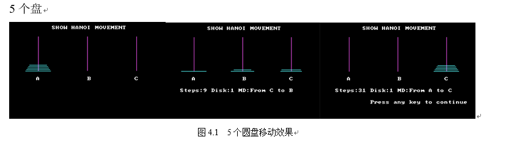
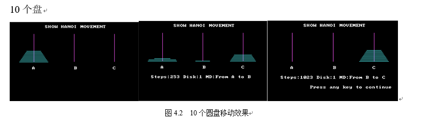
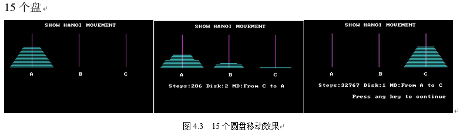
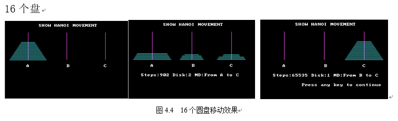
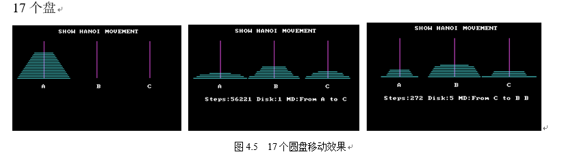

#### 2018ASM 综合性实验
#### 完成 Hanoi 的图示移动过程
（1）16个及以下的移动图示测试：

理论所需移动次数：2^5-1=31 与实际次数 Steps 相符。

理论所需移动次数：2^10-1=1023与实际次数 Steps 相符。

理论所需移动次数：2^15-1=32767 与实际次数 Steps 相符。

理论所需移动次数：2^16-1=65535 与实际次数 Steps 相符。

（2）17个及以上的圆盘移动测试：

理论所需移动次数：217-1=131071 当在移动到第65535之后的移动情况时即“Steps > 65535”时，由于表示数位有限，显示出来的次数就与实际次数不相符了。但此时程序仍然满足Hanoi的圆盘移动。即此时文字显示的Steps出错，但程序仍然正常显示Hanoi圆盘移动。

